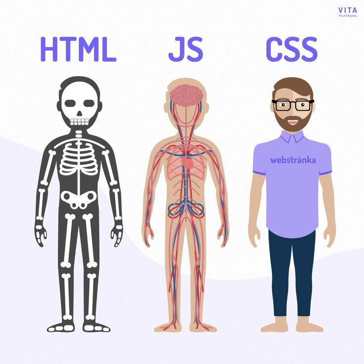

# ᑭᖇOGᖇEᔕᔕIᐯE EᑎᕼᗩᑎᑕEᗰEᑎT
## Some HTML &amp; CSS Practice

### 𝙲𝚘𝚗𝚝𝚎𝚗𝚝:

- [x] HTML is about semantics ex;
- [x] CSS is to improve the visual look ex;
- [x] CSS selectors ex;
- [x] Block model ex;
- [x] CSS selectors (part 2) ex;
- [ ] All other selectors ex;
- [ ] CSS positioning ex;
  